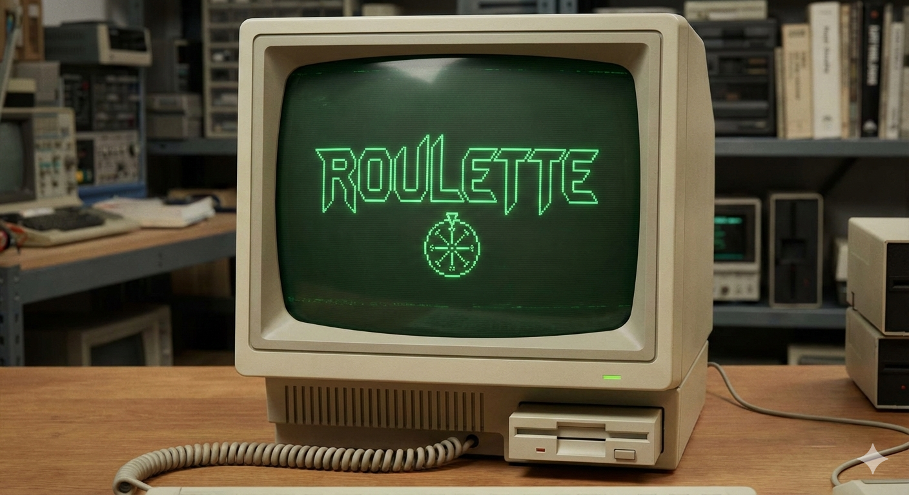

<div align="center">
  
  <h1>Roulette</h1>

[](https://opensource.org/licenses/MIT) [](https://www.gnu.org/software/bash/)

</div>

> ⚠️ **Disclaimer:** This tool can permanently delete files. Use at your own discretion. I am not responsible for any inadvertently lost data.

Play "Russian Roulette" with your video collection. It recursively finds video files in a specified directory and plays one at random using `mpv` with prompts to keep or delete before moving on to next video.

## Why?

I built this out of a need to tackle my ever-growing video collection. With countless files scattered across directories, often times with cryptic names like `IMG_2847.mov`, it was hard to know what I had, what was a duplicate, and what was no longer applicable. Roulette makes it easy to walk down memory lane and quickly decide whether to keep or delete the stops along the way. So far, I've cleaned up close to 100GB of storage!

`mpv` is a great pairing because of its simplicity, availability (homebrew), default keyboard shortcuts (`q` to quit, `f` to toggle full-screen) and command line customization.

## Features

- **Cross-Platform**: Works on macOS, Linux, and WSL (Windows Subsystem for Linux)
- **Custom Directory**: Optionally specify any directory to search
- **Recursive Search**: Finds videos in all subdirectories
- **Auto-Install**: Installs `mpv` via Homebrew if not present (macOS/Linux)
- **Interactive Menu**:
  - `[N]ext` - Play another random video (default)
  - `[r]eplay` - Replay the current video
  - `[i]nfo` - Show media information (requires `mediainfo`)
  - `[d]elete` - Delete the current video file (with confirmation)
  - `[q]uit` - Exit the script
- **Format Support**: Supports common video extensions: `mp4`, `avi`, `mkv`, `mov`, `wmv`, `flv`, `webm`, `m4v`, `mpg`, `mpeg`
- **Environment Variables**: Customize mpv behavior with `MPV_GEOMETRY`

## Prerequisites

- **Bash**: Version 3.2 or later
- **mpv**: The media player used for playback (auto-installed on macOS/Linux if missing)
- **mediainfo** (Optional): For viewing file information with the `[i]nfo` command

## Installation

1. Clone the repository:

   ```bash
   git clone https://github.com/skulltrail/roulette.git
   cd roulette
   ```

   > **Tip:** If you use [direnv](https://direnv.net/), the included `.envrc` automatically adds `bin/` to your PATH while in the project directory so `roulette` should just work!

2. (Optional) Add to your PATH permanently in your shell config (e.g., `~/.bashrc` or `~/.zshrc`):

   ```bash
   export PATH="$PATH:$(pwd)/bin"
   ```

## Usage

```bash
roulette [DIRECTORY]
❯ roulette --debug
    ----------------░░░░░░░-----------------
    ---.--'-'''.---░░]▄▄▄▄▄░░--`'''''-'-''''
    ---------------░░░╣▒░╠▌░░----'''''''''''
    ''---------;░░Q▄░▀╩▓╗▌╩╩Q▄▄░░----------'
    ''''''.'.-;░╠▀░░░░░░▓░░░░░░▀▒µ---'''''''
    ------'-»╔#░░▄╧--░░╚╠╩░░--@▄░╚▒░-'''''''
     ''-'---╓╝░░╙╚≤░-""░▓░░░░≤╛╚░∩╙╩░---'''
         '!░║░░----└▒░;░▓░,µ▒░----░]▌░-
         .-╣░░░░---░░│Φ░╙]▒│-----╓░"]▌-'
       ---░╣░"╠▒╚▀▀▀▀▀▒░▀░╚▀▀▀▀▀▒╚▒-]▌░-'
          .╝Q░,---.`,╗╩░φ░╚▄-''---░░░▌-
          `░║░----;@╚░':╣=-"▒╦░----]▌└'
           '-║▒-╙║░░---░▓░-"`░░φ▒-]▌└'
            '└╙░░-╙---»≤░≥----╙;]ƒ╛░'
               `╙▀╦▄Q--└░░'.╓Qƒ▀▒⌐
                 '└└└▀▀▀▀▀▀▀░└└''
   r o u l e t t e
   Version 1.0


macOS environment detected.
Found media directory: /Volumes/media/archive/video
mpv is already installed.
Found 620 video files.
(::X::) Playing: /Volumes/media/archive/video/IMG_2847.MOV
client removed during hook handling
● Video  --vid=1  (h264 2160x3840 30 fps) [default]
● Audio  --aid=1  (aac 2ch 44100 Hz 173 kbps) [default]
AO: [coreaudio] 44100Hz stereo 2ch floatp
VO: [gpu] 2160x3840 yuv420p
(Paused) AV: 00:00:05 / 00:00:11 (49%) A-V:  0.000 Dropped: 8
Exiting... (Quit)

[q]uit, [d]elete, [i]nfo, [r]eplay, [N]ext: d

WARNING: This will permanently delete the file:
/Volumes/media/archive/video/IMG_2847.MOV

Delete this file? [y/Enter=yes, n=no, q=quit]: y

File deleted successfully.
Found 619 video files.
(::X::) Playing: /Volumes/media/archive/video/IMG_2848.MOV
● Video  --vid=1  (h264 2160x3840 30 fps) [default]
● Audio  --aid=1  (aac 2ch 44100 Hz 173 kbps) [default]
AO: [coreaudio] 44100Hz stereo 2ch floatp
VO: [gpu] 2160x3840 yuv420p
AV: 00:00:01 / 00:00:11 (13%) A-V: -0.000 Dropped: 2
Exiting... (Quit)

[q]uit, [d]elete, [i]nfo, [r]eplay, [N]ext: q
Goodbye!
```

### Configuration

The script attempts to automatically detect your media directory based on your environment:

> Defaults are set to where I have all of my unsorted videos but can be easily changed.

| Environment | Default Paths                                                                    |
| ----------- | -------------------------------------------------------------------------------- |
| macOS       | `/Volumes/media/archive/video`                                                   |
| WSL         | `/mnt/media/archive/video`, `/media/archive/video`, `/mnt/m/media/archive/video` |
| Linux       | `/media/archive/video`, `/mnt/media/archive/video`                               |

You can modify the `detect_media_directory` function in `bin/roulette` to customize these paths.

### Environment Variables

| Variable       | Description                                   |
| -------------- | --------------------------------------------- |
| `MPV_GEOMETRY` | Set mpv window geometry (e.g., `50%x50%+0+0`) |

## Future Enhancements

- **Auto Duplicate Detection**: Identify and flag duplicate videos based on file hash or content fingerprinting
- **Watch History**: Track which videos have been viewed to avoid repeats
- **Favorites/Keep List**: Mark videos to keep, making it easier to focus on undecided files
- **Batch Operations**: Select multiple videos for deletion or moving in one go
- **Filter by Age/Size**: Option to only show videos older than X days or larger than Y MB
- **Export Report**: Generate a summary of deleted files and reclaimed space
- **Custom Keybindings**: Allow users to define their own keyboard shortcuts
- **Move to Folder**: Option to organize videos into folders (e.g., "keep", "review later") instead of just delete
- **Metadata Tagging**: Tag videos for easier search and organization in photo apps
- **Playback Modes**: Option to play subsequent videos in chronological or sequential order

## Development

### Setup

To set up the development environment with linting tools and git hooks:

```bash
make setup
```

This will:

- Install `shellcheck` and `shfmt` locally to `bin/`
- Set up a pre-commit hook that lints and checks formatting of shell scripts
- Set up a commit-msg hook that enforces [Conventional Commits](https://www.conventionalcommits.org/) format

### Make Targets

```bash
make help          # Show all available targets
make setup         # Install dev tools and git hooks
make check         # Run all pre-commit checks (lint + format check)
make lint          # Run shellcheck on all shell files
make format        # Format all shell files with shfmt
make format-check  # Check formatting without modifying files
make test          # Run tests
make all           # Run all checks and tests
```

### Running Tests

Roulette includes a comprehensive test suite using BATS (Bash Automated Testing System).

**Prerequisites:**

```bash
# macOS
brew install bats-core

# Linux
sudo apt-get install bats
```

**Run tests:**

```bash
make test          # Run legacy shell tests
make test-bats     # Run comprehensive BATS test suite
make test-all      # Run all tests
```

The BATS test suite includes 62+ tests covering:

- Help and version commands
- Directory validation and video discovery
- Save-played feature and tracking
- Interactive menu options
- Environment variable configuration
- Error handling and edge cases
- Cross-platform functionality

For detailed test documentation, see [tests/README.md](tests/README.md).
